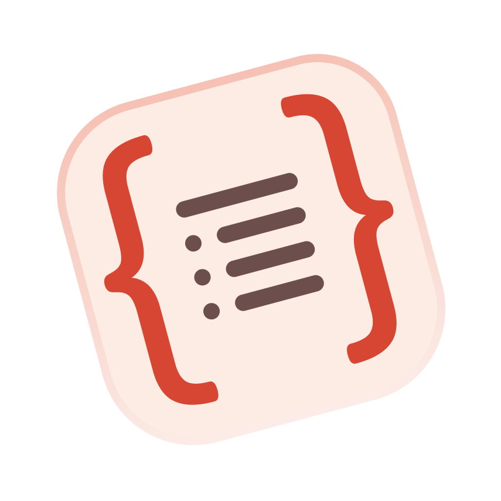

## Hello, I'm Rafael Bahiense 👋
 

 
 

### 90% of my projects are open source !!

 

- You can find my projects here [repos]
- Fullstack Developer certification by [Driven Education].
- I’m currently working at [Trinks].
- I’m currently learning C# / .NET
- I’m looking to collaborate on open source
- Ask me about anything, I'd love to help however I can!
- Fun fact: I speak 2 languages ( Portuguese, English )

 

### Contact me 🤝
 

[][linkedin]
[][email]

 

### Languages and Tools:

 

[][es6]
[][python]
[][c]
[][cpp]
[][html]
[][css]
 
 
 
 
[][visual-studio-code]
[][bash]
[][git]
[][github]
[][react]
[][node-js]
 
 
 
 
[][sql]
[][postgresql]
[][typeorm]

[es6]: https://262.ecma-international.org/6.0/
[python]: https://www.python.org/
[c]: https://www.iso.org/standard/74528.html
[cpp]: https://isocpp.org/
[html]: https://www.w3schools.com/html/
[css]: https://www.w3schools.com/css/
[visual-studio-code]: https://code.visualstudio.com/
[bash]: https://www.gnu.org/software/bash/
[git]: https://git-scm.com/
[github]: https://github.com/
[react]: https://reactjs.org/
[node-js]: https://nodejs.org/
[sql]: https://www.iso.org/standard/63555.html
[postgresql]: https://www.postgresql.org/
[typeorm]: https://typeorm.io/

 
 
 
 

  
:zap: GitHub Stats

  

  
:zap: Most Used Languages

[email]: mailto:rafaelbahiense@id.uff.br
[linkedin]: https://www.linkedin.com/in/rafael-bahiense/
[repos]: https://github.com/RafaelBahiense?tab=repositories/
[driven education]: https://driveneducation.com.br/
[Trinks]: https://www.trinks.com/
